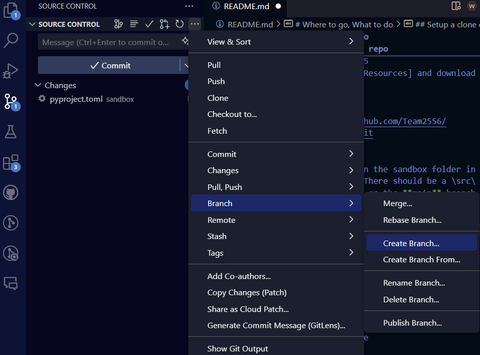

# RobotPython-Training
 Sandbox for training -- transition to python yay


 # Roaches Transition to Python
Why? Well read this: [switch to python](why_switch-python.md)

This repository contains the resources and code we use to initally transition to Python and to train future Raoches.

The 2025 REEFScape season repository (for competiton code) is located at [RobotPython2025](https://github.com/Team2556/RobotPython2025) #TODO: update the repo name and this link once team is over their initial freakout

# Where to go, What to do
- Get [GitHUB](https://github.com/) account and join the [FRC Team 2556](https://github.com/Team2556) organization
- Review the [Python Training Plan](training/traning-plan.md) overview.
- Review #TODO: project, issues, milestones, blahblah.md, wiki ?... for current training activities
- Python is a tool to turn what you are thinking into action, learn how to think: [Systems Engineering exercise](training/challenges/SE-training.md)
- Setup your computer to use python and this repo (see below)


----

## Setup a clone of this repo

0. Create a python based profile in your VS Code: [optional profile file](RobotPy.code-profile)

1. Make sure you have Python 3.12.5
    ```sh
    python --version
    ------------------------ 
    OUTPUT: Python 3.12.5
1a. If not go to [Other Resources] and download it.

2. Clone the repository:
   ```sh
   git clone https://github.com/Team2556/RobotPythonTraining.git
   cd sandbox\
   ```
   This should put you in the sandbox folder in your terminal on VS Code. There should be a \src\ folder and a pyproject.toml file on the **main** branch. We don't want the main branch changed yet, bruh.

1. Create a branch named with your name and publish that to GitHub (origin)

   
1. Create a virtual environment (from a terminal in VS Code; in the repo/sandbox directry on pc)
    ```sh
    python -m venv venv
1. Activate the virtual environment:
    ```sh
    On Windows: 
    venv\Scripts\activate
    On macOS/Linux: 
    source venv/bin/activate
1. Install the dependencies:
    ```sh
    pip install . 
    ```
    The dot (.) references your current directory. From that directory it will use the pyproject.toml to install the proper libraries.

    VS Code will often prompt you as to if you want to use this venv as your working environment (in the big windows, not just the terminal you activated in the previous step).

     [ ] TODO: See what most students seeing and add helper image to get to working in correct venv
 
1. 6. Run the robotpy sync to get the RoboRIO python
    ```sh 
    py -m robotpy sync

1. Run the robot code:
    ```sh
    python src/robot.py


#### **Repository Layout:**

1. **Root Directory:**
   - **README.md:**  
     - A comprehensive overview of the project, including a brief introduction, instructions on how to get started, and links to key resources (like Python tutorials or RobotPy documentation).
   - **CONTRIBUTING.md:**  [ ] TODO...
     - Guidelines for contributing to the repository, including coding standards, commit message conventions, and pull request processes.
   - **.gitignore:**  
     - Specify files and directories to be ignored by Git (e.g., build artifacts, virtual environments).

2. **Directory Structure:**

   - **`/docs/`:**  
     - 'docs' may use a WIKI instead
     - Documentation files (e.g., installation guides, how-to documents, explanation of the code architecture).
     - Consider adding subfolders for `training_materials`, `API_docs`, and `design_docs`.

   - **`/training/`:**
     - **`/basics/`:** Python basics (syntax, loops, functions, etc.)
     - **`/robot_basics/`:** Simple Python examples related to robot control (e.g., motor control, sensor integration).
     - **`/advanced/`:** More complex examples (e.g., autonomous mode routines, vision processing).
     - **`/challenges/`:** Coding challenges and exercises for team members to practice.
     - **`/solutions/`:** Example solutions to the challenges.

   - **`/sandbox/`:**  
     - A subdirectory that is meant to feel like a robot code repo.
     - **`/src/`:**  
     The main source code directory for the robot's Python code, organized by function. 
     - **Top-Level Directories:**
       - **`commands/`**: Houses command logic that directs subsystems.
       - **`components/`**: Stores smaller, reusable pieces of code that don't belong to a specific subsystem but are used across multiple areas (e.g., custom sensors, utility functions).
       - **`subsystems/`**: Contains the code for each major subsystem of the robot, such as drivetrain, shooter, intake, etc.
       - **`autonomous/`**: Dedicated to autonomous routines and strategies.
       - **`pathplanner/`**: Contains path planning logic, trajectory generation, and related code.
       - **Example Layout:**
         ```
         /sandbox/src/
         ├── commands/
         │   ├── drive_command.py
         │   ├── shoot_command.py
         │   └── tests/
         ├── components/
         │   ├── custom_sensor.py
         │   └── utils.py
         ├── subsystems/
         │   ├── drivetrain.py
         │   ├── intake.py
         │   ├── shooter.py
         │   └── tests/
         ├── autonomous/
         │   ├── auto_routines.py
         │   └── tests/
         ├── pathplanner/
         │   ├── trajectory_generator.py
         │   └── path_follower.py
         └── main.py
         ```
     - **`/tests/`:** Unit tests for each component and subsystem. Encourage test-driven development (TDD) where feasible.


#### **Version Control Practices:**

- **Branches:**
  - **`main` Branch:**  
    - The stable branch that contains training resources ready for a new user to branch from and start from the ground up.
  - **`your_name_here` Branch:**  
    - Branches named after the students where active training happens. All features and changes are merged here.
  - **Colab Branches:**  
    - Create separate branches for experimenting with collaboration.

- **Pull Requests (PRs):**
  - Require team members to create PRs when merging code in the feature branches. 
  - Use PRs for code reviews, where other team members can comment and suggest improvements.

- **Issues and Tasks:**
  - Use GitHub Issues to track bugs, feature requests, and tasks. Label them accordingly (e.g., `bug`, `enhancement`, `documentation`). # [] TODO: update
  - Assign team members to issues based on their skills and areas they want to develop.
  
# Other Resources
- Download python (3.12.5): https://www.python.org/downloads/windows/
- Python tutorial: https://docs.python.org/3.12/tutorial/index.html
- More instructions from WPI: https://docs.wpilib.org/en/stable/docs/zero-to-robot/step-2/python-setup.html
- deploy Python to RoboRIO: https://docs.wpilib.org/en/stable/docs/software/python/subcommands/deploy.html
- Command based programming: https://docs.wpilib.org/en/latest/docs/software/commandbased/what-is-command-based.html


# VS Code Extensions
TODO: Refer to our main github readme or sync here....
In the VS Code Extensions sidbar, these codes should help you find usefull extensions (well.. Git and Python are required)
- ms-python.python
- github.vscode-pull-request-github
- github.copilot
- ms-python.black-formatter
- njpwerner.autodocstring
- tamasfe.even-better-toml
- 

## ORIGINAL Setup (FYI)

1. Clone the repository:
   ```sh
   git clone https://github.com/Team2556/RobotPython2025.git
   cd RobotPython2025
2. Create a vertual environment (from a terminal in VS Code; in the repo/sandbox directry on pc)
    ```sh
    python -m venv venv
3. Activate the virtual environment:
    ```sh
    On Windows: 
    venv\Scripts\activate
    On macOS/Linux: 
    source venv/bin/activate
4. Install the dependencies:
    ```sh
    pip install . #the dot references your current directory -->

5. initialize robotpy
    ```sh
    py -m robotpy init

6. Created folders named 'src/subsytems' and 'tests' etc..
    ```sh
    mkdir src/subsytems
    mkdir src/tests

7. move robot.py file created by initilization to 'src' folder
    move robot.py src\ 

6. Ran the robotpy sync to get the RoboRIO python
    ```sh 
    py -m robotpy sync
8. Ran the robot code:
    ```sh
    python src/robot.py
